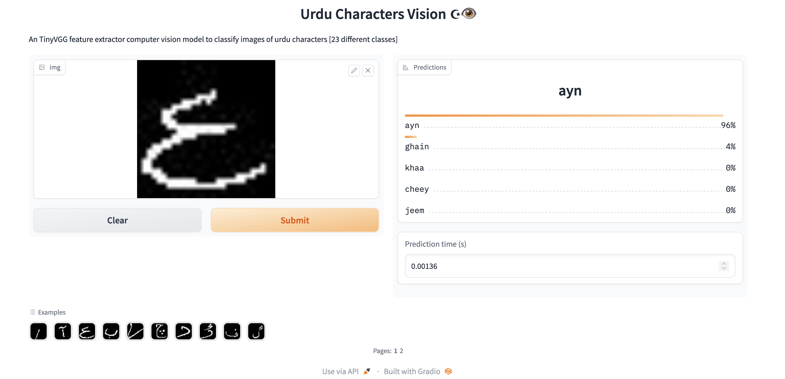

An end-to-end implementation of simple vision problem of multi-class classification using Pytorch and deployed using Gradio on Hugging Face Spaces. I believe this could be a good hello-world for everything computer vision and ML in general.

## [Demo](https://huggingface.co/spaces/kausmos/Urdu-Characters-Vision)
A TinyVGG feature extractor computer vision model to classify images of urdu characters [23 different classes]


## Run locally
```python
Create a virtual environment-
python3 -m virtualenv venv
source venv/bin/activate

Install dependencies-
pip install -r requirements.txt

Run the app-
python app.py
```